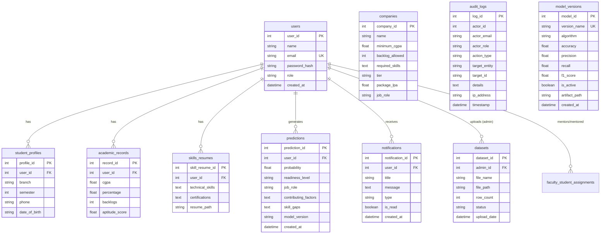

# Campus Placement Prediction & Diagnostic Intelligence System

An enterprise-grade, end-to-end web application that predicts campus placement likelihood for students using machine learning, diagnoses skill gaps against top corporate recruiters, provides faculty mentoring workflows, and delivers institutional analytics with zero-downtime model retraining.

---

## 🚀 Key Features & Architectural Modules

The application is structured into 10 cohesive modules:

### 1. Authentication & Role-Based Access Control (RBAC)
- Secure **bcrypt** password hashing and **JWT** (JSON Web Token) authentication.
- Role-based middleware enforcing strict separation across `Student`, `Faculty`, and `Admin` personas.
- Configurable session lifetimes and automatic expiration handling.

### 2. Student Profile & Academic Data Management
- Comprehensive profile and academic performance tracking.
- Server-side validation enforcing domain constraints:
  - CGPA range: `0.0` to `10.0`
  - Backlog count: `>= 0`
  - Percentage: `0.0%` to `100.0%`
  - Aptitude score: `0` to `100`
- Student resume upload supporting `.pdf` and `.docx` formats with disk storage linking.

### 3. Dataset Management (Admin)
- Admin upload portal supporting `.csv` and `.xlsx` training datasets.
- Automated schema verification requiring features: `cgpa`, `percentage`, `backlogs`, `aptitude_score`, `technical_skills`, and `placed`.
- Rejection of malformed datasets with descriptive validation reports and 10-row dataset preview modal.

### 4. Machine Learning Prediction Engine
- **Scikit-Learn Preprocessing Pipeline**: `ColumnTransformer` with `StandardScaler` for continuous metrics and tokenizing `CountVectorizer` for multi-label technical skills.
- **Model Architectures**: Random Forest Classifier, Gradient Boosting, and Logistic Regression.
- **Ultra-Fast Real-Time Inference**: Sub-100ms response time (exceeding the `< 3 seconds` requirement).
- **Contributing Factors Breakdown**: Quantifies feature importance (+/- percentage weights for CGPA, backlogs, aptitude test scores, and skills).
- **Corporate Recruiter Matcher**: Real-time eligibility evaluation against target firms (e.g., Google, Microsoft, Amazon, Cisco, TCS, Infosys, Deloitte).

### 5. Prediction Visualization (Frontend)
- Custom semi-circle **Recharts** probability gauge with dynamic color grading:
  - **High Readiness** ($\ge 75\%$) — Emerald Green
  - **Moderate Readiness** ($50\% - 74.9\%$) — Amber
  - **Needs Improvement** ($< 50\%$) — Rose Red
- Factor impact visualization with positive/negative feature indicators.
- Recruiter eligibility matrix highlighting matched criteria vs missing skills.
- Mandatory Advisory Disclaimer banner strictly enforced across all screens.

### 6. Faculty Readiness Monitoring
- RBAC-isolated dashboard where faculty mentors only view students explicitly assigned to them.
- Batch analytics: Average cohort probability, at-risk student count, and high-readiness tier count.
- Mentoring notes and intervention modal with risk flags (`Normal`, `At Risk`, `High Attention`).

### 7. Admin Reporting & Management
- Aggregate analytics: Branch-wise placement likelihood and academic CGPA distribution donut charts.
- Top skills frequency analysis across student cohorts.
- Exportable institutional reports in **CSV** and formatted **PDF** formats (powered by `reportlab`).
- Filterable prediction history table.

### 8. In-App Notifications
- Real-time in-app notification dropdown with unread badge counter.
- Automated notification trigger whenever an assessment is recomputed or profile is updated.
- One-click "Mark all read" and individual read state toggles.

### 9. Model Versioning & Zero-Downtime Retraining
- Versioned model artifact storage (`.joblib`) with tracking of Accuracy, Precision, Recall, and F1-Score.
- Zero-downtime hot-swapping: Admin can retrain on newly uploaded datasets or switch the active model version instantly without server restarts.

### 10. Institutional Audit Trail & Security
- Immutable audit logging recording `actor_id`, `actor_email`, `action_type`, `target_entity`, `details`, `ip_address`, and `timestamp` for every prediction run and administrative operation.
- Searchable and filterable audit log viewer for administrators.

---

## 🛠️ Technology Stack

| Layer | Technology |
| :--- | :--- |
| **Backend API** | Python 3.10+, FastAPI, Uvicorn, Pydantic v2 |
| **Database & ORM**| SQLite / MySQL Compatible with SQLAlchemy 2.0 |
| **Machine Learning**| Scikit-Learn, Pandas, NumPy, Joblib |
| **Security & Auth** | Passlib, Bcrypt, Python-Jose (JWT) |
| **PDF Generation** | ReportLab |
| **Frontend UI** | React 18, Vite, Vanilla CSS Design System with Glassmorphism |
| **Visualizations** | Recharts (Gauge, Bar Charts, Donut Charts) |
| **Icons & Design** | Lucide React, Google Fonts (Outfit & Plus Jakarta Sans) |

---

## 🗄️ Database Schema



---

## ⚡ Quick Start Guide

### Prerequisites
- **Python 3.10+**
- **Node.js 18+** & **npm**

---

### Step 1: Backend Setup & Seed Data

1. Navigate to the `backend` directory:
   ```bash
   cd backend
   ```

2. Install Python dependencies:
   ```bash
   pip install -r requirements.txt
   ```

3. Initialize the database and train the baseline model:
   ```bash
   python -m app.ml.seed_data
   ```

4. Start the FastAPI backend server:
   ```bash
   python -m uvicorn app.main:app --host 127.0.0.1 --port 8000 --reload
   ```
   - Swagger Interactive Documentation: [http://127.0.0.1:8000/docs](http://127.0.0.1:8000/docs)

---

### Step 2: Frontend Setup & Launch

1. Open a new terminal and navigate to the `frontend` directory:
   ```bash
   cd frontend
   ```

2. Install frontend dependencies:
   ```bash
   npm install
   ```

3. Start the Vite development server:
   ```bash
   npm run dev
   ```
   - Application URL: [http://127.0.0.1:5173](http://127.0.0.1:5173)

---

## 🔑 Pre-Configured Demo Accounts

For rapid evaluation, 1-click login buttons are provided on the login page:

| Persona | Email | Password | Role & Permissions |
| :--- | :--- | :--- | :--- |
| **Student** | `student@college.edu` | `Student@123` | Placement assessment, profile & academic records, resume upload, factor analysis, recruiter eligibility |
| **Faculty** | `faculty@college.edu` | `Faculty@123` | Assigned students readiness roster, batch statistics, counseling notes, risk level management |
| **Administrator** | `admin@college.edu` | `Admin@123` | Executive analytics, CSV/PDF report export, CSV/Excel dataset upload, zero-downtime model retrainer, corporate recruiters CRUD, security audit trail |

---

## 🧪 Running Automated Tests

A comprehensive unit and integration test suite is included in `backend/tests/test_api.py`:

```bash
cd backend
python -m pytest tests/test_api.py -v
```

### Tested Capabilities:
- ✅ Authentication (Registration, Login, JWT verification)
- ✅ Student profile CRUD and server-side range validation (CGPA, backlogs, percentage)
- ✅ ML Prediction inference latency ($< 3000\text{ms}$) and factor analysis
- ✅ RBAC authorization and faculty cohort isolation
- ✅ Admin aggregate statistics calculation
- ✅ Export of CSV and formatted PDF reports
- ✅ Immutable audit log recording

---

## ⚠️ Advisory Disclaimer Notice

> **Mandatory Institutional Notice**: Predictions generated by this system are statistical advisory estimates based on machine learning models and must **not** be presented as a guarantee of placement anywhere in the user interface or external communications.
